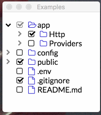

# react-checkbox-tree

[](https://www.npmjs.com/package/react-checkbox-tree)
[](https://app.travis-ci.com/github/jakezatecky/react-checkbox-tree)
[](https://raw.githubusercontent.com/jakezatecky/react-checkbox-tree/master/LICENSE.txt)

> A simple and elegant checkbox tree for React.



## Usage

### Installation

Install the library using your favorite dependency manager:

```
yarn add react-checkbox-tree
```

Using npm:

```
npm install react-checkbox-tree --save
```

> **Note** &ndash; This library makes use of [Font Awesome](http://fontawesome.io/) styles and expects them to be loaded in the browser.

> **Note** &ndash; Although **React 18** should work, our unit tests run against React 17 due to incompatibility with the unit testing tool (Enzyme).

### Include CSS

For your convenience, the library's styles can be consumed utilizing one of the following files:

* `node_modules/react-checkbox-tree/lib/react-checkbox-tree.css`
* `node_modules/react-checkbox-tree/src/less/react-checkbox-tree.less`
* `node_modules/react-checkbox-tree/src/scss/react-checkbox-tree.scss`

Either include one of these files in your stylesheets or utilize a CSS loader:

``` javascript
import 'react-checkbox-tree/lib/react-checkbox-tree.css';
```

### Render Component

A quick usage example is included below. Note that the react-checkbox-tree component is [controlled](https://facebook.github.io/react/docs/forms.html#controlled-components). In other words, you must update its `checked` and `expanded` properties whenever a change occurs.

``` jsx
import React from 'react';
import CheckboxTree from 'react-checkbox-tree';

const nodes = [{
    value: 'mars',
    label: 'Mars',
    children: [
        { value: 'phobos', label: 'Phobos' },
        { value: 'deimos', label: 'Deimos' },
    ],
}];

class Widget extends React.Component {
    state = {
        checked: [],
        expanded: [],
    };

    render() {
        return (
            <CheckboxTree
                nodes={nodes}
                checked={this.state.checked}
                expanded={this.state.expanded}
                onCheck={checked => this.setState({ checked })}
                onExpand={expanded => this.setState({ expanded })}
            />
        );
    }
}
```

All node objects **must** have a unique `value`. This value is serialized into the `checked` and `expanded` arrays and is also used for performance optimizations.

#### Changing the Default Icons

By default, **react-checkbox-tree** uses Font Awesome 4 for the various icons that appear in the tree. To utilize Font Awesome 5 icons, simply pass in `iconsClass="fa5"`:

``` jsx
<CheckboxTree
    ...
    iconsClass="fa5"
/>
```

To change the rendered icons entirely, simply pass in the `icons` property and override the defaults. Note that you can override as many or as little icons as you like:

``` jsx
<CheckboxTree
    ...
    icons={{
        check: <span className="rct-icon rct-icon-check" />,
        uncheck: <span className="rct-icon rct-icon-uncheck" />,
        halfCheck: <span className="rct-icon rct-icon-half-check" />,
        expandClose: <span className="rct-icon rct-icon-expand-close" />,
        expandOpen: <span className="rct-icon rct-icon-expand-open" />,
        expandAll: <span className="rct-icon rct-icon-expand-all" />,
        collapseAll: <span className="rct-icon rct-icon-collapse-all" />,
        parentClose: <span className="rct-icon rct-icon-parent-close" />,
        parentOpen: <span className="rct-icon rct-icon-parent-open" />,
        leaf: <span className="rct-icon rct-icon-leaf" />,
    }}
/>
```

If you are using the [`react-fontawesome`](https://github.com/FortAwesome/react-fontawesome) library, you can also directly substitute those icons:

``` jsx
import { FontAwesomeIcon } from '@fortawesome/react-fontawesome'

...

<CheckboxTree
    ...
    icons={{
        check: <FontAwesomeIcon className="rct-icon rct-icon-check" icon="check-square" />,
        uncheck: <FontAwesomeIcon className="rct-icon rct-icon-uncheck" icon={['fas', 'square']} />,
        halfCheck: <FontAwesomeIcon className="rct-icon rct-icon-half-check" icon="check-square" />,
        expandClose: <FontAwesomeIcon className="rct-icon rct-icon-expand-close" icon="chevron-right" />,
        expandOpen: <FontAwesomeIcon className="rct-icon rct-icon-expand-open" icon="chevron-down" />,
        expandAll: <FontAwesomeIcon className="rct-icon rct-icon-expand-all" icon="plus-square" />,
        collapseAll: <FontAwesomeIcon className="rct-icon rct-icon-collapse-all" icon="minus-square" />,
        parentClose: <FontAwesomeIcon className="rct-icon rct-icon-parent-close" icon="folder" />,
        parentOpen: <FontAwesomeIcon className="rct-icon rct-icon-parent-open" icon="folder-open" />,
        leaf: <FontAwesomeIcon className="rct-icon rct-icon-leaf-close" icon="file" />
    }}
/>
```

### Utility Functions

In addition to the `CheckboxTree` component, additional utility functions are available to set the initial state of the tree.

#### `expandNodesToLevel(nodes, targetLevel)`

Creates a list of all parent node keys until `targetLevel`.

Arguments:

* `nodes` (`Array`): The same array of nodes passed into the main `CheckboxTree` component
* `targetLevel` (`number`): The maximum expansion depth. Use `Infinity` for maximum depth.

Returns:

* `Array`: A list of node keys.

### Properties

| Property             | Type     | Description                                                                                                            | Default     |
| -------------------- | -------- | ---------------------------------------------------------------------------------------------------------------------- | ----------- |
| `nodes`              | array    | **Required**. Specifies the tree nodes and their children.                                                             |             |
| `checkModel`         | string   | Specifies which checked nodes should be stored in the `checked` array. Accepts `'leaf'` or `'all'`.                    | `'leaf'`    |
| `checked`            | array    | An array of checked node values.                                                                                       | `[]`        |
| `direction`          | string   | A string that specify whether the direction of the component is left-to-right (`'ltr'`) or right-to-left (`'rtl'`).    | `'ltr'`     |
| `disabled`           | bool     | If true, the component will be disabled and nodes cannot be checked.                                                   | `false`     |
| `expandDisabled`     | bool     | If true, the ability to expand nodes will be disabled.                                                                 | `false`     |
| `expandOnClick`      | bool     | If true, nodes will be expanded by clicking on labels. Requires a non-empty `onClick` function.                        | `false`     |
| `expanded`           | array    | An array of expanded node values.                                                                                      | `[]`        |
| `icons`              | object   | An object containing the mappings for the various icons and their components. See **Changing the Default Icons**.      | `{ ... }`   |
| `iconsClass`         | string   | A string that specifies which icons class to utilize. Currently, `'fa4'` and `'fa5'` are supported.                    | `'fa4'`     |
| `id`                 | string   | A string to be used for the HTML ID of the rendered tree and its nodes.                                                | `null`      |
| `lang`               | object   | An object containing the language mappings for the various text elements.                                              | `{ ... }`   |
| `name`               | string   | Optional name for the hidden `<input>` element.                                                                        | `undefined` |
| `nameAsArray`        | bool     | If true, the hidden `<input>` will encode its values as an array rather than a joined string.                          | `false`     |
| `nativeCheckboxes`   | bool     | If true, native browser checkboxes will be used instead of pseudo-checkbox icons.                                      | `false`     |
| `noCascade`          | bool     | If true, toggling a parent node will **not** cascade its check state to its children.                                  | `false`     |
| `onlyLeafCheckboxes` | bool     | If true, checkboxes will only be shown for leaf nodes.                                                                 | `false`     |
| `optimisticToggle`   | bool     | If true, toggling a partially-checked node will select all children. If false, it will deselect.                       | `true`      |
| `showExpandAll`      | bool     | If true, buttons for expanding and collapsing all parent nodes will appear in the tree.                                | `false`     |
| `showNodeIcon`       | bool     | If true, each node will show a parent or leaf icon.                                                                    | `true`      |
| `showNodeTitle`      | bool     | If true, the `label` of each node will become the `title` of the resulting DOM node. Overridden by `node.title`.       | `false`     |
| `onCheck`            | function | onCheck handler: `function(checked, targetNode) {}`                                                                    | `() => {}`  |
| `onClick`            | function | onClick handler: `function(targetNode) {}`. If set, `onClick` will be called when a node's label has been clicked.     | `() => {}`  |
| `onExpand`           | function | onExpand handler: `function(expanded, targetNode) {}`                                                                  | `() => {}`  |

#### `onCheck` and `onExpand`

#### Node Properties

Individual nodes within the `nodes` property can have the following structure:

| Property       | Type   | Description                              | Default |
| -------------- | ------ | ---------------------------------------- | ------- |
| `label`        | mixed  | **Required**. The node's label.          |         |
| `value`        | mixed  | **Required**. The node's value.          |         |
| `children`     | array  | An array of child nodes.                 | `null`  |
| `className`    | string | A className to add to the node.          | `null`  |
| `disabled`     | bool   | Whether the node should be disabled.     | `false` |
| `icon`         | mixed  | A custom icon for the node.              | `null`  |
| `showCheckbox` | bool   | Whether the node should show a checkbox. | `true`  |
| `title`        | string | A custom `title` attribute for the node. | `null`  |
